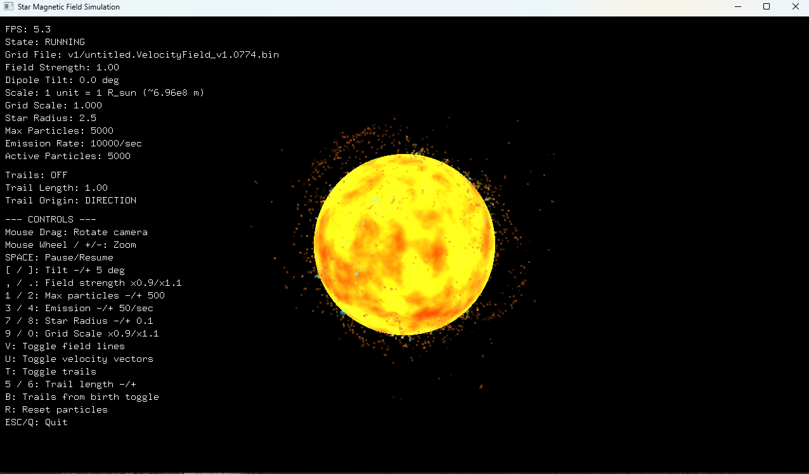

# OpenGL Star Simulation

A GPU-accelerated particle simulation of a star, driven by **real velocity-field data** (exported from a VDB workflow). Particles are advected through the vector field and rendered in real time with interactive camera controls, trails, and tuning parameters.



## Overview

This project visualizes a star-like flow using a precomputed **vector field** (originating from VDB data). Instead of integrating OpenVDB directly (out of scope for this project), the vector field is converted into a lightweight binary format and sampled at runtime to drive particle motion.

Related project inspiration/demo (Houdini workflow):  
https://harrison-martin.com/#/projects/8Bvxdn

## Visual encoding

- Color is mapped along a **blackbody-style gradient** from red → blue
- Color represents **particle speed**:
  - **Blue** = faster
  - **Red** = slower

## Run

### Option A (Windows)
Run:
- `final.exe`

### Option B (Build from source)
```bash
make
./final.exe
```

> Tip: For a denser / more impressive result, increase the maximum particle count as high as your machine can handle.

## Controls

- **Mouse**: orbit / pan / zoom camera
- **Space**: pause / resume simulation
- **,** / **.**: decrease / increase field strength
- **1** / **2**: decrease / increase max particles (acts like higher emission because emission is high by default)
- **3** / **4**: decrease / increase emission rate (use carefully)
- **5** / **6**: adjust trail length (mostly for testing)
- **7** / **8**: decrease / increase star radius (for experimentation; not physically accurate)
- **9** / **0**: resize the vector velocity field (testing)
- **U**: toggle velocity vector display (shows the underlying field direction)
- **T**: toggle particle trails
- **B**: show full particle path since spawn (when trails are enabled)
- **R**: reset particles
- **ESC** / **Q**: quit immediately (useful if you push settings too far)

## Notes

- Some controls/features are marked deprecated in the original project notes and may not have an effect depending on build/version.

---

**Author:** Harrison (`harri665`)
