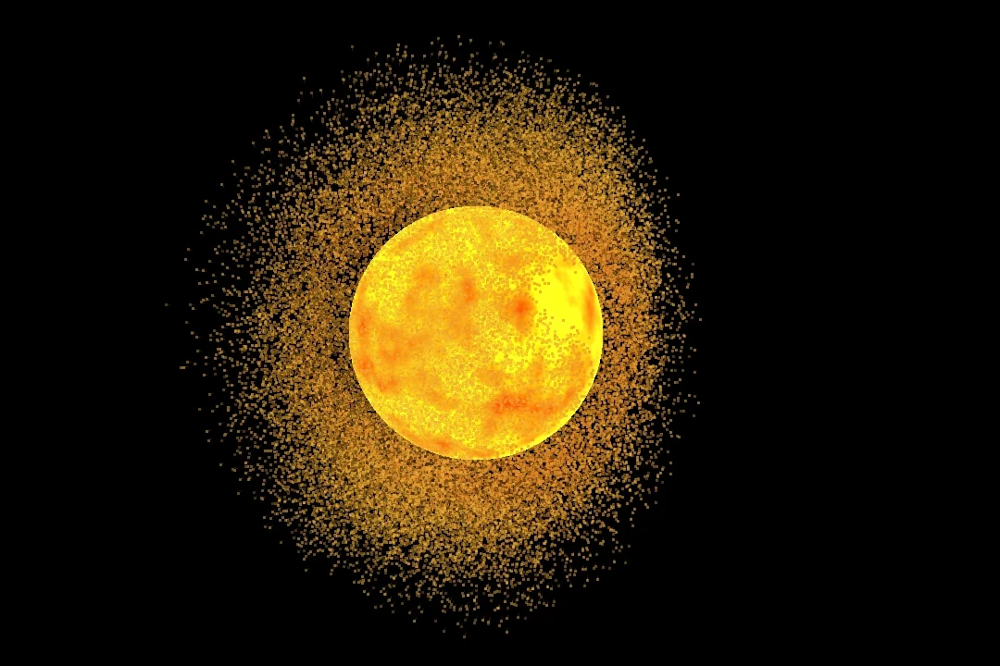

# OpenGL Star Simulation

A real-time particle visualisation of a neutron star's magnetic field. Particles are advected on the GPU with OpenCL, through either a velocity field converted from Houdini VDB data (NASA IXPE observations, via LASP) or an analytic tilted magnetic dipole, and rendered with OpenGL.



## Features

- OpenCL particle integration, with up to 2M particle slots
- Two field modes: sampled VDB-derived velocity frames, or an analytic dipole with Lorentz-force motion
- Speed-coloured particles (red slow, blue fast), optional trails, field-line and velocity-vector debug views
- Runtime controls for field strength, dipole tilt, emission, particle count and star radius
- Python converter from `.vdb` to a dependency-free binary grid

## Build

Requires a C compiler, OpenGL, (free)GLUT and an OpenCL runtime (NVIDIA, AMD and Intel drivers include one). The OpenCL headers are bundled in `CL/`.

```bash
make
./final
```

On Windows, build from an MSYS2 MinGW shell with freeglut and the OpenCL ICD loader installed (`pacman -S mingw-w64-x86_64-freeglut mingw-w64-x86_64-opencl-icd`). On macOS, the Makefile uses the system GLUT, OpenGL and OpenCL frameworks.

## Data

Without data, the simulation uses the analytic dipole field. To drive it with a VDB velocity sequence:

1. Put the Houdini `.vdb` frames in `v1/`, named `untitled.VelocityField_v1.0001.vdb`, `…0002.vdb`, and so on.
2. Convert them (requires Python with `numpy` and OpenVDB bindings, for example `conda install -c conda-forge openvdb`):

   ```bash
   python convert_vdb_to_bin.py
   ```

   This writes a `.bin` next to each `.vdb`: a header (`GRID`, version, dimensions, voxel size, origin) followed by a dense `float32` xyz velocity array.
3. Run `./final`. It loads the next frame each rendered frame and loops after frame 1000.

## Controls

| input | action |
|---|---|
| mouse drag | rotate the camera |
| mouse wheel, `+` / `-` | zoom |
| Space | pause / resume |
| `[` / `]` | dipole tilt −/+ 5° |
| `,` / `.` | field strength ×0.9 / ×1.1 |
| `1` / `2` | max particles −/+ 500 |
| `3` / `4` | emission −/+ 50 per second |
| `5` / `6` | trail length −/+ |
| `7` / `8` | star radius −/+ 0.1 |
| `9` / `0` | grid scale ×0.9 / ×1.1 |
| `T` | toggle trails |
| `B` | trails from birth position |
| `V` | toggle field lines |
| `U` | toggle velocity vectors |
| `R` | reset particles |
| Esc / `Q` | quit |

## Performance

The frame rate is currently limited by data movement, not the GPU. Each frame reads all 2M particle slots back from OpenCL (about 88 MB) and draws them with immediate-mode OpenGL on the CPU, and in data mode it also reads the next grid frame from disk. Sharing the particle buffer between OpenCL and OpenGL (`clCreateFromGLBuffer`) and dispatching over live particles only are the planned fixes.

## Contributing

Issues and pull requests are welcome, especially the performance work above, and trilinear sampling of the velocity grid (it currently uses the nearest voxel).

## Related

- The offline Houdini version of this visualisation: [IXPE Data Visualization](https://art.harrison-martin.com/8Bvxdn)
- Write-up: [A Neutron Star's Magnetic Field in Real Time](https://blog.harrison-martin.com/neutron-star-fields)
